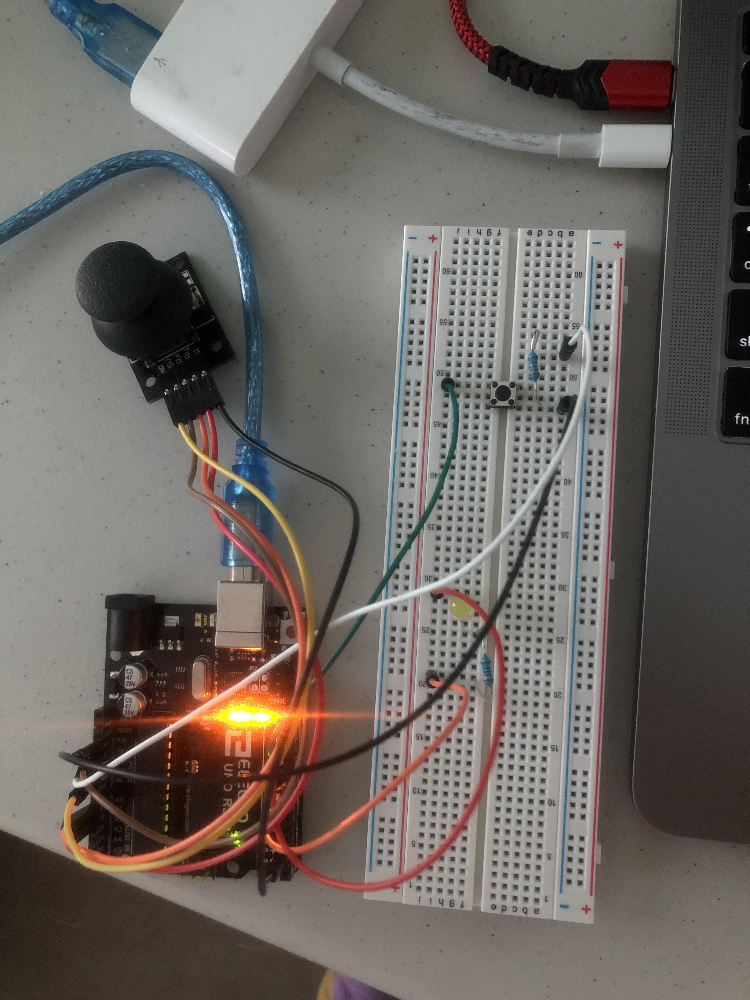

# An Arduino/Processing Platformer
The fourth/final project submission for the Direct Cinema Media Fabrics course offered at the University of Virginia.

This project uses the infinite looping of the Arduino program to produce a movable, animated character in a simple environment. This character is movable by the user using the joystick attachment, and is able to interact with certain items on screen when in close range. These objects change when the user decides to interact with them via the button attachment. Character movement is performed via the joystick attachment, and an LED attachment is included for further immersion.

### Hardware Setup
This project uses an UNO Elegoo microprocessor, the joystick attachment, the button attachment, and a single LED.

